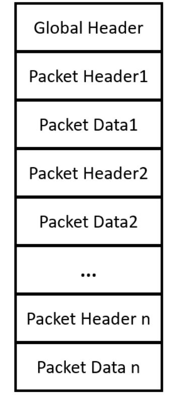
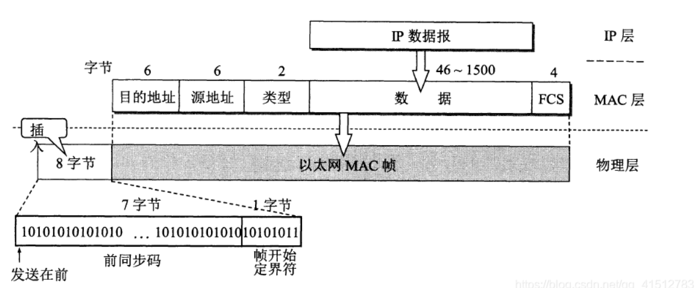
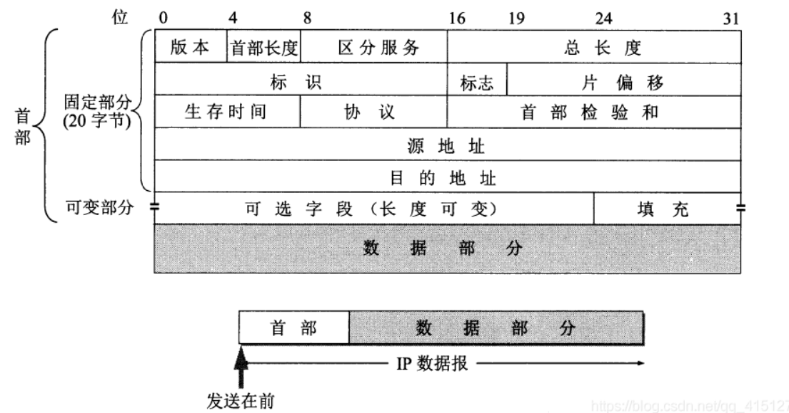
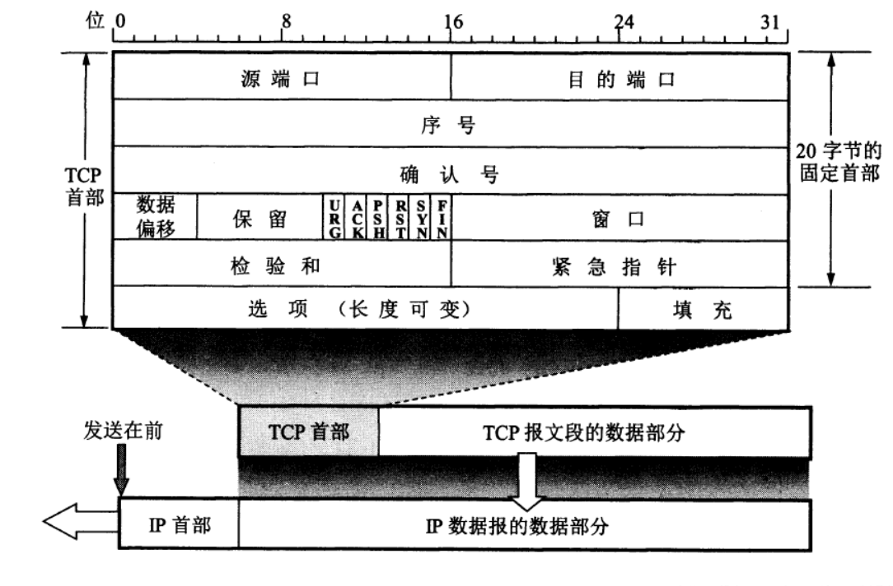

### PCAP文件格式



如上图所示，PCAP文件是由一个global header，后面跟着若干组packet header + data组成的

global header一共有24字节，下面字段也是按照顺序排列的

- magic，占4B，如果它的值是`0xa1b2c3d4`，代表 Pcap 文件是大端模式存储的；如果它的值是 `0xd4c3b2a1`，代表 Pcap 文件是小端模式存储的。这里注意**这里的大端小端仅仅是指 Pcap 文件的 Global Header 和 Packet Header，而无关Packet Data 里的内容。**Packet Data里面就是利用抓包工具如wireshark捕获的数据包，他们都是符合网络字节序的，而网络字节序就是大端模式。
- major，占2B，文件的主版本号，一般为0x0200。
- minor，占2B，文件的次要版本号，一般为0x0400。
- thisZone，占4B，当地标准时间，如果是GMT则全为0。
- sigFigs，占4B，时间戳精度，一般全0。
- snapLen，占4B，最长存储长度。
- linkType，占4B，链路类型，以太网则为1，一般为1。


packet header共有16个字节，以下字段也是按照文件顺序列出的

- timestamp，占4B，时间戳高位，精确到seconds，这是Unix时间戳。捕获数据包的时间一般是根据这个值。
- timestamp，占4B，时间戳低位，能够精确到microseconds。
- capLen，占4B，当前数据区的长度，即抓取到的数据帧长度，由此可以得到下一个数据帧的位置。
- len，占4B，离线数据长度，网路中实际数据帧的长度，一般不大于capLen，多数情况下和capLen值一样。如果文件中保存不是完整的数据包，那么这个值可能要比前面的数据包长度的值大。


### Packet Data

Packet Data其实就是我们熟悉的数据链路层头部 + IP头 + 传输层头部（TCP/UDP）+ （TLS）+ Application data

- 以太网的帧结构

  

  可以看到共有14个字节，6个字节的源MAC，6个字节的目的MAC以及2个字节的网络层协议类型（2048表示的是IP）

- IP头部结构

  

  如果去掉选项字段，那么IP头部共有20个字节，这程序中我目前只解析了这20字节的头部，因为选项字段中有一些信息有的数据包中有，有的数据包中没有，处理起来比较麻烦，所以直接把这个选项字段暂时越过去了

- TCP头部结构

  

  TCP数据段的首部长度也不是固定的，图中的数据偏移就相当于首部的长度，注意单位是4字节，然后根据此值截取相应的长度对TCP的首部进行解析。


### 大端模式和小端模式

0x123456在内存中的存储方式

\- 大端模式：高字节存放在低地址

```cpp
  低地址 -----> 高地址
  0x12 | 0x34 | 0x56 
```

\- 小端模式：低字节存放在低地址

```cpp
  低地址 -----> 高地址
  0x56 | 0x34 | 0x12 
```

大小端模式各有优势：小端模式强制转换类型时不需要调整字节内容，直接截取低字节即可；大端模式由于符号位为第一个字节，很方便判断正负。


相同字节序的平台在进行网络通信时可以不进行字节序转换，但是跨平台进行网络数据通信时必须进行字节序转换。TCP/IP协议规定了大端模式，还专门除了网络字节序和主机字节序相互转换的接口
